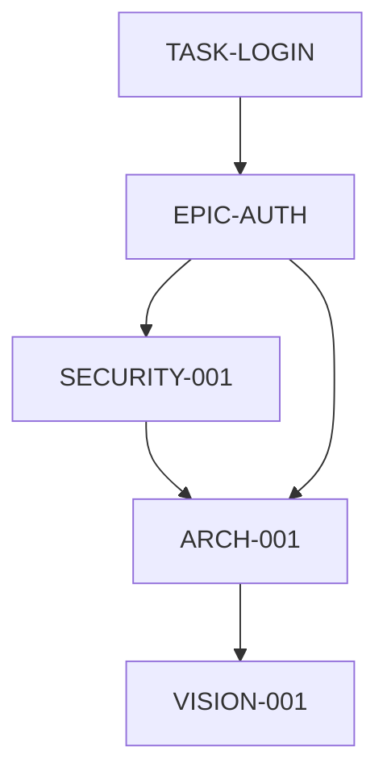
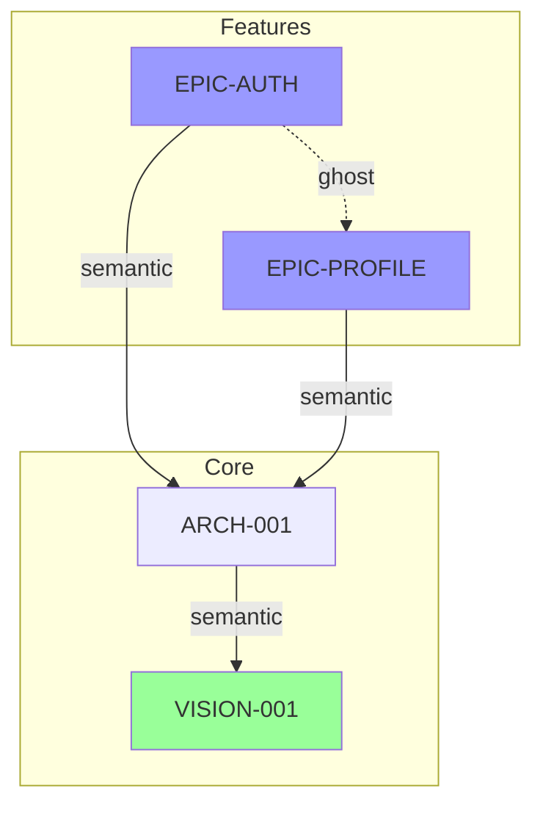

# Method #90: Dependency Topology Mapping

## Classification
- **Category:** Sanity
- **Phase:** Implementation / Validation
- **Purpose:** Discover hidden dependencies and coupling

## Core Principle

```
┌─────────────────────────────────────────────────────────────────────────────┐
│  "Find hidden coupling (ghosts: high coupling, no visible link) and dead   │
│   links (visible link, no real coupling)"                                  │
└─────────────────────────────────────────────────────────────────────────────┘
```

## Dependency Types

| Type | Description | Example |
|------|-------------|---------|
| **Explicit** | Declared in depends_on | "ARCH-001 depends on VISION-001" |
| **Implicit** | Undeclared but real | Shared database, timing assumptions |
| **Ghost** | High coupling, no visible link | Two components that break together |
| **Dead Link** | Declared but not real | Stale dependency declaration |

## Execution Protocol

### Step 1: Map Explicit Dependencies

Extract declared dependencies from YAML headers:

```markdown
## Explicit Dependency Map



| From | To | Type | Declared In |
|------|-----|------|-------------|
| ARCH-001 | VISION-001 | semantic_source | ARCH-001 header |
| SECURITY-001 | ARCH-001 | hard_constraint | SECURITY-001 header |
| EPIC-AUTH | ARCH-001 | semantic_source | EPIC-AUTH header |
| EPIC-AUTH | SECURITY-001 | hard_constraint | EPIC-AUTH header |
| TASK-LOGIN | EPIC-AUTH | semantic_source | TASK-LOGIN header |
```

### Step 2: Hunt for Implicit Dependencies

Search for undeclared coupling:

```markdown
## Implicit Dependency Hunt

### Shared State Analysis
| State | Components Using | Coupling Type |
|-------|------------------|---------------|
| Database schema | AUTH, PROFILE, BILLING | Data structure |
| Session storage | AUTH, ALL_SERVICES | Runtime state |
| Config files | ALL | Environment |
| Feature flags | AUTH, PAYMENT | Behavior toggle |

**IMPLICIT DEPENDENCY FOUND:**
- AUTH and PAYMENT both depend on feature flag service
- Not declared in either component

### Timing Assumptions
| Component | Assumes | Dependency |
|-----------|---------|------------|
| NOTIFICATION | EMAIL_SERVICE up | Startup order |
| REPORT | DATA_WAREHOUSE populated | ETL completion |
| CACHE | SOURCE updated first | Invalidation timing |

**IMPLICIT DEPENDENCY FOUND:**
- REPORT assumes ETL runs before report generation
- Not declared anywhere

### Environment Requirements
| Component | Requires | Why |
|-----------|----------|-----|
| AUTH | REDIS | Session storage |
| SEARCH | ELASTICSEARCH | Full-text index |
| FILE_SERVICE | S3 | Object storage |

**IMPLICIT DEPENDENCY FOUND:**
- AUTH silently fails without REDIS
- No explicit infrastructure dependency declared
```

### Step 3: Identify Ghosts

Find components that break together without declared relationship:

```markdown
## Ghost Detection

### Failure Correlation Analysis
When X fails, Y also fails (historically):

| X | Y | Correlation | Declared? |
|---|---|-------------|-----------|
| AUTH | PROFILE | 95% | NO - GHOST |
| PAYMENT | BILLING | 100% | YES |
| SEARCH | RECOMMEND | 80% | NO - GHOST |
| EMAIL | NOTIFICATION | 100% | YES |

### Ghost Investigation

**GHOST 1: AUTH ↔ PROFILE**
- Investigation: Both use same user cache
- Root cause: Shared cache invalidation
- Action: Declare dependency or decouple

**GHOST 2: SEARCH ↔ RECOMMEND**
- Investigation: Recommend uses search results
- Root cause: Undocumented internal API call
- Action: Declare dependency
```

### Step 4: Identify Dead Links

Find declared dependencies that don't exist in practice:

```markdown
## Dead Link Detection

| Declared Dependency | Actually Used? | Evidence |
|---------------------|----------------|----------|
| BILLING → LEGACY_PRICING | NO | LEGACY_PRICING deprecated 6mo ago |
| REPORT → OLD_METRICS | NO | Switched to NEW_METRICS |
| AUTH → LDAP_PROVIDER | NO | Now using OAuth only |

**DEAD LINKS FOUND: 3**
Action: Remove stale dependencies from YAML headers
```

---

## Output Template

```markdown
## Dependency Topology Analysis

### Explicit Dependencies: {count}

[Mermaid diagram]

### Implicit Dependencies Found: {count}

| Type | From | To | Evidence | Action |
|------|------|-----|----------|--------|
| Shared state | {A} | {B} | {evidence} | Declare/Decouple |
| Timing | {A} | {B} | {evidence} | Declare/Document |
| Environment | {A} | {B} | {evidence} | Declare |

### Ghosts Found: {count}

| Ghost Pair | Correlation | Root Cause | Action |
|------------|-------------|------------|--------|
| {A} ↔ {B} | {%} | {cause} | {action} |

### Dead Links Found: {count}

| Declared | Reason Dead | Action |
|----------|-------------|--------|
| {dep} | {reason} | Remove |

### Updated Dependency Graph
[Corrected mermaid diagram]

### Topology Metrics

| Metric | Value | Threshold | Status |
|--------|-------|-----------|--------|
| Total nodes | {N} | - | - |
| Total edges | {E} | - | - |
| Max depth | {D} | <5 | ✅/❌ |
| Orphan nodes | {O} | 0 | ✅/❌ |
| Coupling coefficient | {C} | <0.5 | ✅/❌ |

### Verdict
[ ] Topology clean - proceed
[ ] Implicit deps declared - update headers
[ ] Ghosts resolved - restructure
[ ] Dead links removed - cleanup complete
```

---

## Integration with Deep-Process

### When to Execute
- **Architecture phase** - Establish initial topology
- **Before major changes** - Understand impact radius
- **Periodically** - Catch drift
- **Post-incident** - Find hidden couplings

### Automatic Topology Maintenance
```yaml
# In state.json
topology:
  last_scan: "2025-01-30T10:00:00Z"
  explicit_edges: 25
  implicit_found: 3
  ghosts: 1
  dead_links: 2
  health: "NEEDS_ATTENTION"
```

### Stale Flagging Integration
When topology changes:
1. Identify affected nodes via dependency graph
2. Flag dependents as STALE
3. Include in [UPDATE_STATE]

### State Update
```yaml
execution:
  dependency_topology:
    nodes: 15
    explicit_edges: 20
    implicit_found: 4
    ghosts: 2
    dead_links: 3
    max_depth: 4
```

---

## Visualization Best Practices

### Mermaid Graph Tips


**Legend:**
- Solid lines: Declared dependencies
- Dashed lines: Ghosts (undeclared coupling)
- Colors: Node types or health status

---

## Common Topology Anti-Patterns

### 1. Hub and Spoke
```
Problem: One node has many dependents
Risk: Single point of failure for changes
Solution: Consider splitting the hub
```

### 2. Circular Dependencies
```
Problem: A → B → C → A
Risk: Change cascades infinitely
Solution: Break cycle with interface/abstraction
```

### 3. Deep Chains
```
Problem: A → B → C → D → E → F (depth > 5)
Risk: Small changes at root cascade widely
Solution: Flatten hierarchy where possible
```

### 4. Orphan Nodes
```
Problem: Node with no incoming or outgoing edges
Risk: May be dead code/docs or missing links
Solution: Connect or remove
```

---

## Method Rationale

This method exists because:
- Explicit dependencies tell only part of the story
- Hidden couplings cause unexpected cascade failures
- Stale dependencies create false complexity
- Understanding true topology enables safe changes

The goal is a complete, accurate map of how components actually relate, not just how they're declared to relate.
