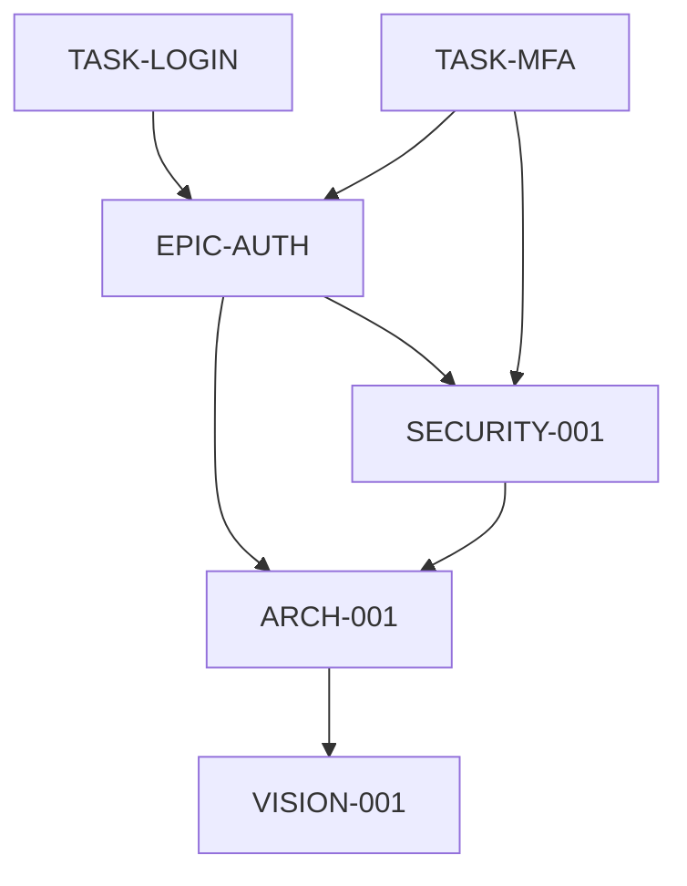

# Method #159: Transitive Dependency Closure

## Classification
- **Category:** Dependency
- **Phase:** Implementation / Validation
- **Purpose:** Build complete dependency graph and detect cycles/gaps

## Core Principle

```
┌─────────────────────────────────────────────────────────────────────────────┐
│  "Build dependency graph then compute transitive closure via DFS.          │
│   Path A→...→A = circular dependency. Node with in-degree>0 and no         │
│   definition = missing dependency."                                        │
└─────────────────────────────────────────────────────────────────────────────┘
```

## Execution Protocol

### Step 1: Build Direct Dependency Graph

Extract all direct dependencies:

```markdown
## Direct Dependencies

### From YAML Headers
| Node | depends_on | Type |
|------|------------|------|
| ARCH-001 | VISION-001 | semantic_source |
| SECURITY-001 | ARCH-001 | hard_constraint |
| EPIC-AUTH | ARCH-001, SECURITY-001 | mixed |
| TASK-LOGIN | EPIC-AUTH | semantic_source |
| TASK-MFA | EPIC-AUTH, SECURITY-001 | mixed |

### Graph Representation

```

### Step 2: Compute Transitive Closure

Use DFS to find all reachable nodes from each node:

```markdown
## Transitive Closure

### DFS from each node:

**From TASK-LOGIN:**
```
TASK-LOGIN
  → EPIC-AUTH
    → ARCH-001
      → VISION-001 (terminal)
    → SECURITY-001
      → ARCH-001 (visited)
```
**Transitive dependencies:** EPIC-AUTH, ARCH-001, SECURITY-001, VISION-001

**From TASK-MFA:**
```
TASK-MFA
  → EPIC-AUTH
    → ARCH-001
      → VISION-001 (terminal)
    → SECURITY-001
      → ARCH-001 (visited)
  → SECURITY-001 (visited)
```
**Transitive dependencies:** EPIC-AUTH, ARCH-001, SECURITY-001, VISION-001

### Closure Matrix

| Node | Direct Deps | Transitive Deps (total) |
|------|-------------|-------------------------|
| VISION-001 | 0 | 0 |
| ARCH-001 | 1 | 1 |
| SECURITY-001 | 1 | 2 |
| EPIC-AUTH | 2 | 4 |
| TASK-LOGIN | 1 | 5 |
| TASK-MFA | 2 | 5 |
```

### Step 3: Detect Cycles

Look for paths that return to origin:

```markdown
## Cycle Detection

### DFS with Cycle Check

```python
# Pseudocode for cycle detection
def detect_cycles(node, visited, stack):
    visited.add(node)
    stack.add(node)

    for dep in node.depends_on:
        if dep in stack:
            return f"CYCLE: {node} → ... → {dep}"
        if dep not in visited:
            result = detect_cycles(dep, visited, stack)
            if result:
                return result

    stack.remove(node)
    return None
```

### Results

| Check | Result |
|-------|--------|
| VISION-001 | No cycle |
| ARCH-001 | No cycle |
| SECURITY-001 | No cycle |
| EPIC-AUTH | No cycle |
| TASK-LOGIN | No cycle |
| TASK-MFA | No cycle |

**CYCLES FOUND: 0**
```

### Step 4: Detect Missing Dependencies

Find referenced nodes that don't exist:

```markdown
## Missing Dependency Detection

### References vs Definitions

| Referenced In | Reference | Exists? |
|---------------|-----------|---------|
| ARCH-001 | VISION-001 | ✅ YES |
| SECURITY-001 | ARCH-001 | ✅ YES |
| EPIC-AUTH | ARCH-001 | ✅ YES |
| EPIC-AUTH | SECURITY-001 | ✅ YES |
| EPIC-AUTH | API-SPEC-001 | ❌ **NO** |
| TASK-LOGIN | EPIC-AUTH | ✅ YES |

### Missing Definitions

| Referenced | By | In-Degree | Status |
|------------|-----|-----------|--------|
| API-SPEC-001 | EPIC-AUTH | 1 | **MISSING** |

**Action:** Create API-SPEC-001 or remove reference from EPIC-AUTH
```

### Step 5: Detect Transitive Conflicts

Find nodes that conflict through dependency chains:

```markdown
## Transitive Conflict Detection

### Conflict Propagation

If A conflicts with B, and C depends on A, then C transitively conflicts with B.

### Known Conflicts
| Node A | Node B | Type |
|--------|--------|------|
| (none detected) | | |

### Potential Conflicts via Semantic Hash

Checking if transitive parents have conflicting facts:

**TASK-LOGIN inherits from:**
- EPIC-AUTH: "Auth: OAuth2"
- SECURITY-001: "Session: 8 hours"
- ARCH-001: "DB: PostgreSQL"
- VISION-001: "Target: Small teams"

**Consistency check:** No conflicts in inherited facts.

**TASK-MFA inherits from:**
- EPIC-AUTH: "Auth: OAuth2"
- SECURITY-001: "MFA: Required for all"
- ARCH-001: "DB: PostgreSQL"
- VISION-001: "Target: Small teams"

**Consistency check:** "Small teams" might conflict with "MFA for all"
**Flag:** Potential conflict - create Decision Point?
```

---

## Output Template

```markdown
## Transitive Dependency Closure Analysis

### Graph Statistics

| Metric | Value |
|--------|-------|
| Total nodes | {N} |
| Total direct edges | {E} |
| Max depth | {D} |
| Avg dependencies per node | {avg} |

### Direct Dependency Graph
[Mermaid diagram]

### Transitive Closure

| Node | Direct | Transitive | Total |
|------|--------|------------|-------|
| {node} | {d} | {t} | {total} |

### Cycle Detection

**Cycles found: {count}**

{If cycles:}
- CYCLE: {A} → {B} → {C} → {A}
  - Impact: {what breaks}
  - Resolution: {how to break cycle}

### Missing Dependencies

**Missing: {count}**

| Missing Node | Referenced By | Action |
|--------------|---------------|--------|
| {node} | {referencer} | Create/Remove |

### Transitive Conflicts

**Conflicts: {count}**

| Path | Conflict | Resolution |
|------|----------|------------|
| {A}→{B}→{C} | {desc} | {action} |

### Recommendations

1. {Recommendation based on findings}

### Verdict
[ ] Graph is acyclic and complete - proceed
[ ] Missing nodes identified - create or fix
[ ] Cycles detected - must break before proceed
[ ] Transitive conflicts - Decision Points needed
```

---

## Integration with Deep-Process

### When to Execute
- **Before COMMITTED** - Ensure no cycles or missing deps
- **After adding dependencies** - Verify graph integrity
- **System health check** - Periodic validation

### Automatic Propagation
When node changes:
1. Compute transitive dependents
2. Flag all as STALE
3. Include in [UPDATE_STATE]

### State Update
```yaml
execution:
  transitive_closure:
    nodes: 6
    edges: 7
    max_depth: 4
    cycles: 0
    missing: 1
    transitive_conflicts: 0
```

---

## Cycle Breaking Strategies

### Strategy 1: Introduce Interface
```
Before: A → B → C → A (cycle)
After:  A → Interface ← B → C → A' implements Interface
```

### Strategy 2: Merge Nodes
```
Before: A → B → A (tight cycle)
After:  AB (merged node)
```

### Strategy 3: Extract Common Ancestor
```
Before: A → B, B → A (mutual dependency)
After:  A → Common ← B
```

### Strategy 4: Direction Reversal
```
Before: A → B → C → A
Question: Does C really depend on A, or A on C?
Fix: Correct the direction
```

---

## Algorithmic Details

### DFS for Transitive Closure
```python
def transitive_closure(node, graph, visited=None):
    if visited is None:
        visited = set()

    visited.add(node)

    for dep in graph.get(node, []):
        if dep not in visited:
            transitive_closure(dep, graph, visited)

    return visited
```

### Topological Sort (if acyclic)
```python
def topological_sort(graph):
    visited = set()
    result = []

    def dfs(node):
        if node in visited:
            return
        visited.add(node)
        for dep in graph.get(node, []):
            dfs(dep)
        result.append(node)

    for node in graph:
        dfs(node)

    return result  # Leaves first, roots last
```

---

## Method Rationale

This method exists because:
- Direct dependencies don't show full impact
- Cycles create infinite update loops
- Missing definitions cause runtime failures
- Transitive conflicts are hidden in complex graphs

The goal is a complete, consistent dependency graph that enables safe change propagation.
