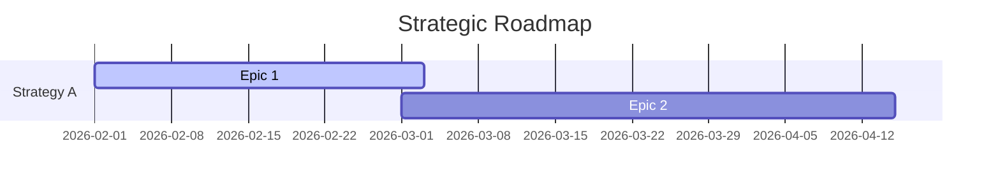

# Generate Project Roadmap

## Purpose
Visualize the strategic alignment and timeline of the project. Connect Strategies -> Epics -> Time.

## Instructions
1.  **Collect Data:** Read all Epics and Strategies.
2.  **Group by Status:**
    *   **Now/Next:** Epics with `status: active` or `planned`.
    *   **Later:** Epics with `status: defined` but no date.
    *   **Parking Lot:** Ideas without formal definition.
3.  **Generate Mermaid Gantt:** Create a Gantt chart for the "Now/Next" items.
4.  **Generate Traceability Matrix:** Table showing `Strategy -> Epic -> Status`.
5.  **Output:** Save to `artifacts/ROADMAP.md`.

## Example Mermaid

## Verification
- [ ] Are all active Epics visible?
- [ ] Is the link to Strategy clear?
