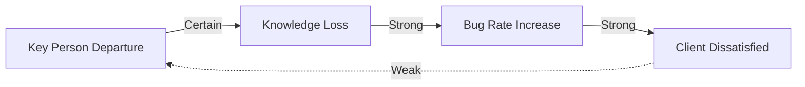

# 301 - Risk Cascade Mapping

## Phase
INTERACT

## Purpose
Trace how one risk materializing triggers or amplifies others. Build directed graphs of risk propagation. Individual risks are manageable - cascades cause catastrophes.

## Core Concept

Risks don't exist in isolation. When Risk A materializes:
- It may **trigger** Risk B (causation)
- It may **amplify** Risk B (make it more likely or severe)
- It may **combine** with Risk B for multiplicative effect

Understanding these relationships is critical because:
- Mitigating root risks prevents multiple downstream risks
- Terminal risks need robust defenses (many paths lead there)
- Loops create exponential escalation

## Procedure

### Step 1: Pairwise Analysis
For each pair of risks (A, B), ask:
> "If Risk A materializes, does it increase the probability or impact of Risk B?"

### Step 2: Document Relationship
If yes, document:
- **Mechanism:** How does A affect B?
- **Strength:** Weak / Strong / Certain

| Strength | Description |
|----------|-------------|
| **Weak** | Slightly increases P or I of B |
| **Strong** | Significantly increases P or I of B |
| **Certain** | A materializing guarantees B materializes |

### Step 3: Build Directed Graph
Create graph: A → B means "A can trigger or amplify B"

### Step 4: Analyze Graph Structure

| Pattern | Identification | Implication |
|---------|---------------|-------------|
| **Root risks** | High out-degree (many outgoing edges) | Mitigate first - maximum cascade prevention |
| **Terminal risks** | High in-degree (many incoming edges) | Need robust defenses - many paths lead here |
| **Chain risks** | Long paths A→B→C→...→Z | Single failure can cascade far |
| **Amplification loops** | A→B→A (cycles) | Positive feedback - exponential escalation |

### Step 5: Identify Critical Paths
Find paths where:
- All edges are Strong or Certain
- Path leads to CRITICAL or NON_ERGODIC risk

These are highest priority for mitigation.

## Output Schema
```yaml
cascades:
  - source: "RISK-XXX"
    source_title: "Source risk description"
    target: "RISK-YYY"
    target_title: "Target risk description"
    mechanism: "How source triggers or amplifies target"
    strength: "[Weak|Strong|Certain]"
    type: "[Trigger|Amplify]"

graph_analysis:
  root_risks:
    - risk_id: "RISK-XXX"
      out_degree: 5
      risks_triggered: ["RISK-YYY", "RISK-ZZZ", ...]

  terminal_risks:
    - risk_id: "RISK-YYY"
      in_degree: 4
      risks_that_trigger: ["RISK-AAA", "RISK-BBB", ...]

  chain_risks:
    - path: ["RISK-XXX", "RISK-YYY", "RISK-ZZZ"]
      length: 3
      all_strong: true

  amplification_loops:
    - loop: ["RISK-XXX", "RISK-YYY", "RISK-XXX"]
      escalation_factor: "Exponential"
```

## Quality Checks
- [ ] All risk pairs examined for relationships
- [ ] Mechanisms documented
- [ ] Strength assessed
- [ ] Graph analysis completed
- [ ] Root and terminal risks identified
- [ ] Loops detected

## Connections
- Feeds into: #302 (correlation complements causation), #305 (compound scenarios)
- Uses output from: #101-#112 (identified risks)
- Related to: #306 (min-cut finds critical cascade points)

## Example

### Risk Relationships Table
```yaml
cascades:
  - source: "RISK-001"
    source_title: "Key engineer leaves"
    target: "RISK-002"
    target_title: "Knowledge loss"
    mechanism: "Undocumented knowledge walks out the door"
    strength: Certain
    type: Trigger

  - source: "RISK-002"
    source_title: "Knowledge loss"
    target: "RISK-003"
    target_title: "Increased bug rate"
    mechanism: "New maintainers make mistakes without context"
    strength: Strong
    type: Trigger

  - source: "RISK-003"
    source_title: "Increased bug rate"
    target: "RISK-004"
    target_title: "Client dissatisfaction"
    mechanism: "More bugs → more incidents → unhappy client"
    strength: Strong
    type: Trigger

  - source: "RISK-004"
    source_title: "Client dissatisfaction"
    target: "RISK-001"
    target_title: "Key engineer leaves"
    mechanism: "Unhappy client → pressure → burnout → departure"
    strength: Weak
    type: Amplify
```

### Graph Visualization
```
     ┌───────────────────────────────────────┐
     │                                       │
     ▼                                       │ (Weak - amplify)
[RISK-001] ──Certain──► [RISK-002] ──Strong──► [RISK-003] ──Strong──► [RISK-004]
Key Person              Knowledge             Bug Rate               Client
Departure               Loss                  Increase               Dissatisfied
     │
     │
     └──────► (Root risk: out-degree=1, but critical chain starter)
```

### Analysis
```yaml
graph_analysis:
  root_risks:
    - risk_id: "RISK-001"
      out_degree: 1
      comment: "Chain starter - mitigating this prevents entire cascade"

  terminal_risks:
    - risk_id: "RISK-004"
      in_degree: 1
      comment: "End of chain - but creates feedback loop"

  chain_risks:
    - path: ["RISK-001", "RISK-002", "RISK-003", "RISK-004"]
      length: 4
      all_strong: true (except last weak link)
      comment: "Critical cascade path"

  amplification_loops:
    - loop: ["RISK-001", "...", "RISK-004", "RISK-001"]
      escalation_factor: "Weak but present"
      comment: "Vicious cycle - departure → problems → pressure → more departure"
```

## Cascade Prevention Strategy

Based on graph analysis:

1. **Break the root:** Mitigate RISK-001 (key person) to prevent entire cascade
2. **Strengthen defenses at terminal:** Robust client communication regardless of bugs
3. **Insert circuit breakers:** Documentation between RISK-001 and RISK-002
4. **Dampen the loop:** Address pressure/burnout independently

## Graph Visualization Tools

For complex risk networks, use:
- Graphviz DOT notation
- Mermaid diagrams
- Network analysis tools (NetworkX)


